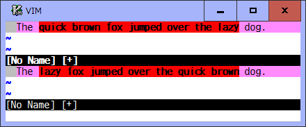
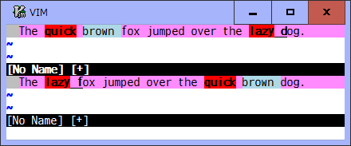
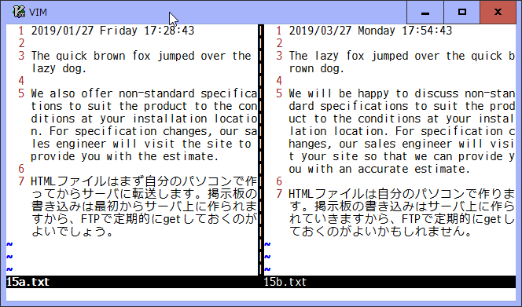

# diffchar.vim
*Highlight the exact differences, based on characters and words*
```
 ____   _  ____  ____  _____  _   _  _____  ____   
|    | | ||    ||    ||     || | | ||  _  ||  _ |  
|  _  || ||  __||  __||     || | | || | | || | ||  
| | | || || |__ | |__ |   __|| |_| || |_| || |_||_ 
| |_| || ||  __||  __||  |   |     ||     ||  __  |
|     || || |   | |   |  |__ |  _  ||  _  || |  | |
|____| |_||_|   |_|   |_____||_| |_||_| |_||_|  |_|
```

#### Introduction

This plugin has been developed in order to make diff mode more useful. Vim
highlights all the text in between the first and last different characters on
a changed line. But this plugin will find the exact differences between them,
character by character - so called *DiffChar*.

For example, in diff mode:  


this plugin will exactly show the changed and added units:  


This plugin will synchronously show/reset the highlights of the exact
differences as soon as the diff mode starts/ends since a `g:DiffModeSync` is
enabled as a default. It synchronously works as well on your custom diff tool
(e.g. git-diff) when you have specified it to the `diffexpr` option.

In non-diff mode or when the `g:DiffModeSync` is disabled, you can toggle to
show/reset the diff highlights by pressing `<F7>` or `<F8>` or using `:TDChar`
command. To show or reset them, use `:SDChar` or `:RDChar` command.

In diff mode, the corresponding changed lines are compared between two
windows. In non-diff mode, the same lines are compared among them. You can
set a matching color to a `g:DiffColors` to make it easy to recognize the
corresponding changed units between two windows. As a default, all the
changed units are highlighted with `DiffText`. In addition, `DiffAdd` is always
used for the added units and both the previous and next character of the
deleted units are shown in bold/underline.

In order to check the actual differences in a line, you can use `:EDChar`
command and echo the lines for range. A changed, added, and deleted unit
is shown as `[-...-][+...+]`, `[+...+]`, and `[-...-]` respectively,
while showing its highlight. When [!] is not used, this command tries to
shorten some equivalent units and show `...` instead, if the line is
too long to fit on the command line.

This plugin traces the differences based on a `g:DiffUnit`. Its default is
'Word1' and it handles a \w\\+ word and a \W character as a difference unit.
There are other types of word provided and you can also set 'Char' to compare
character by character.

While showing the exact differences, when cursor is moved on a difference
unit, you can see its corresponding unit with cursor-like highlight in another
window, and also its whole string with the assigned color as a message,
based on `g:DiffPairVisible`.

You can use `]b` or `]e` to jump cursor to the start or end position of the next
difference unit, and `[b` or `[e` to the start or end position of the previous
unit. Those keymaps, `<F7>` and `<F8>` are configurable in your vimrc and so on.

This plugin always keeps the exact differences updated while editing if a
`g:DiffUpdate` is enabled and TextChanged/TextChangedI events are available.

This plugin has been using "An O(NP) Sequence Comparison Algorithm" developed
by S.Wu, et al., which always finds an optimum sequence quickly. But for
longer lines and less-similar files, it takes time to complete the diff
tracing. To make it more efficient, this plugin splits the tracing with the
external diff command. Firstly applies the internal O(NP) algorithm. If not
completed within the time specified by a `g:DiffSplitTime`, continuously
switches to the diff command at that point, and then joins both results. This
approach provides a stable performance and reasonable accuracy, because the
diff command effectively optimizes between them. Its default is 100 ms, which
would be useful for smaller files. If prefer to always apply the internal
algorithm for accuracy (or the diff command for performance), set some large
value (or 0) to it.

This plugin sets the `DiffCharExpr()` to the `diffexpr` option, if it is empty.
It also uses the `g:DiffSplitTime` and splits the tracing between the
internal algorithm and the external diff command. If prefer to leave the
`diffexpr` option as empty, set 0 to a `g:DiffExpr`.

This plugin works on each tab page individually. You can use a tab page
variable (t:), instead of a global one (g:), to specify different options on
each tab page.

This plugin has been always positively supporting mulltibyte characters.

#### Commands

* `:[range]SDChar`
  * Show the highlights of difference units for [range]
* `:[range]RDChar`
  * Reset the highlights of difference units for [range]
* `:[range]TDChar`
  * Toggle to show/reset the highlights for [range]
* `:[range]EDChar[!]`
  * Echo the line, by enclosing added/deleted units in `[+...+]`/`[-...-]`,
    for [range]. Some equivalent units may be shown as `...`.
    When [!] is used, the lines will not be truncated.

#### Keymaps

* `<Plug>ToggleDiffCharAllLines` (default: `<F7>` if not mapped)
  * Toggle to show/reset the highlights for all/selected lines
* `<Plug>ToggleDiffCharCurrentLine` (default: `<F8>` if not mapped)
  * Toggle to show/reset the highlights for current/selected lines
* `<Plug>JumpDiffCharPrevStart` (default: `[b`)
  * Jump cursor to the start position of the previous difference unit
* `<Plug>JumpDiffCharNextStart` (default: `]b`)
  * Jump cursor to the start position of the next difference unit
* `<Plug>JumpDiffCharPrevEnd` (default: `[e`)
  * Jump cursor to the end position of the previous difference unit
* `<Plug>JumpDiffCharNextEnd` (default: `]e`)
  * Jump cursor to the end position of the next difference unit

#### Options

* `g:DiffUnit`, `t:DiffUnit` - Type of difference unit
  * 'Word1'  : \w\\+ word and any \W single character (default)
  * 'Word2'  : non-space and space words
  * 'Word3'  : \\< or \\> character class boundaries
  * 'Char'   : any single character
  * 'CSV(,)' : separated by characters such as ',', ';', and '\t'
* `g:DiffColors`, `t:DiffColors` - Matching colors for changed unit pairs (always DiffAdd for added units)
  * 0   : always DiffText (default)
  * 1   : 4 colors in fixed order
  * 2   : 8 colors in fixed order
  * 3   : 16 colors in fixed order
  * 100 : all colors defined in highlight option in dynamic random order
* `g:DiffPairVisible`, `t:DiffPairVisible` - Make a corresponding unit visible when cursor is moved on a difference unit
  * 2 : highlight with cursor-like color plus echo as a message (default)
  * 1 : highlight with cursor-like color
  * 0 : nothing visible
* `g:DiffUpdate`, `t:DiffUpdate` - Interactively updating the diff highlights while editing (available on vim 7.4)
  * 1 : enable (default)
  * 0 : disable
* `g:DiffSplitTime`, `t:DiffSplitTime` - A time length (ms) to apply the internal algorithm first
  * 0 ~ : (100 as default)
* `g:DiffModeSync`, `t:DiffModeSync`- Synchronously show/reset with diff mode
  * 1 : enable (default)
  * 0 : disable
* `g:DiffExpr`- Set `DiffCharExpr()` to the `diffexpr` option
  * 1 : enable (default)
  * 0 : disable

#### Demo


```viml
:let t:DiffModeSync = 0
:windo diffthis | windo set wrap
:%SDChar
:%RDChar
:diffoff!

:let t:DiffModeSync = 1        " this is a default value
:windo diffthis | windo set wrap
:diffoff!

:let t:DiffColors = 3
:windo diffthis | windo set wrap
:EDChar          " on line 3 in the left window
:EDChar!
<space>          " cursor move forward on line 5 in the left window
]b               " several times on line 7 in the left window
:diffoff!
```
